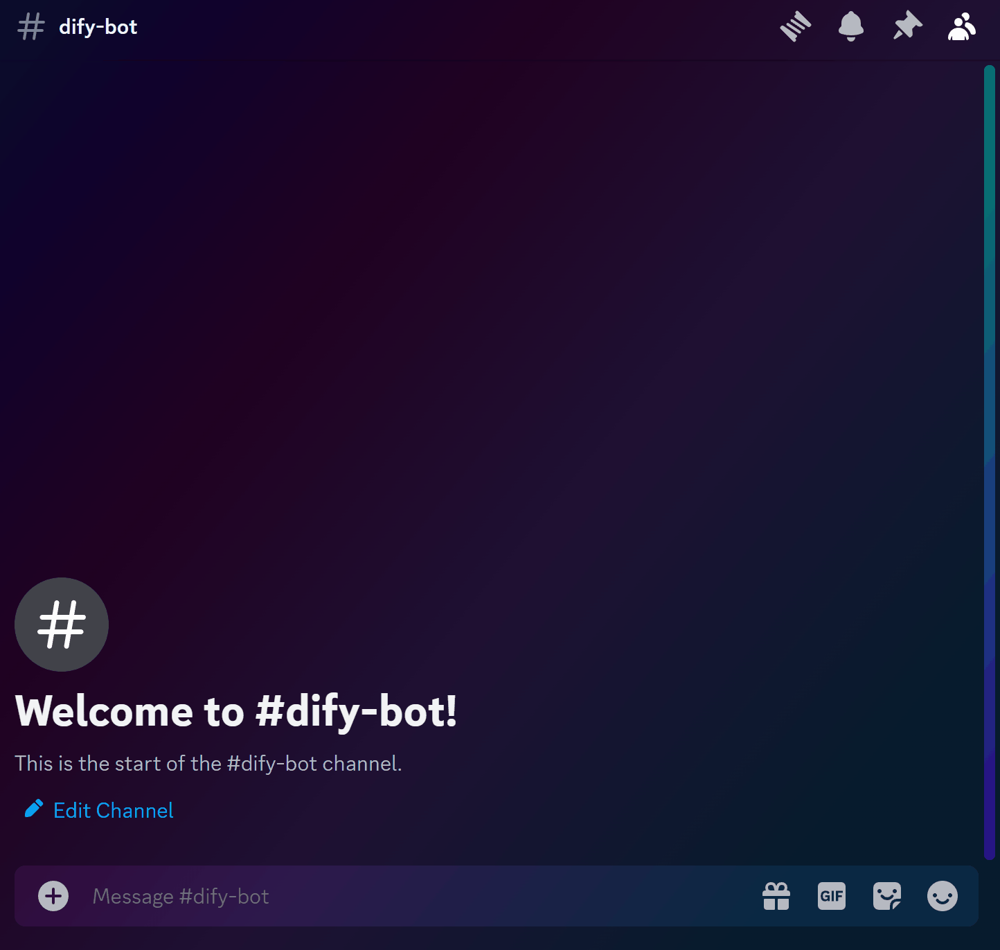

# Dify-Discord-Starter 🤖✨

Chào mừng bạn đến với dự án **Dify-Discord-Starter**! Đây là một mẫu khởi động hiện đại và dễ sử dụng để tạo một Discord bot tích hợp với ứng dụng Dify. Sử dụng mẫu này để xây dựng bot của riêng bạn và kích hoạt khả năng trò chuyện tương tác trong cộng đồng Discord của bạn.

<p align="center">
  
  <i>Demo được tạo bằng <a href="assets\example_app.yml">Ứng dụng Dify mẫu</a></i>
</p>

## Tính năng chính 🚀

- **Hỗ trợ Slash Command**: Người dùng có thể tương tác với bot bằng lệnh `/chat` trực tiếp trong Discord.
- **Tích hợp với Dify**: Gửi và nhận tin nhắn liền mạch thông qua ứng dụng Dify.
- **Phản hồi tạm thời**: Giữ cuộc trò chuyện riêng tư bằng cách gửi tin nhắn tạm thời chỉ người dùng lệnh mới có thể xem.
- **Cài đặt bot đơn giản**: Dễ dàng thêm bot vào bất kỳ máy chủ Discord nào chỉ với một lệnh.
- **Ứng dụng linh hoạt**: Mẫu khởi động này được thiết kế để hoạt động với mọi loại trợ lý Dify, từ trợ lý cơ bản đến chatbot agent hoặc chatflow phức tạp.

## Yêu cầu trước khi cài đặt 📋

Trước khi bắt đầu, hãy đảm bảo bạn đã cài đặt:

- Node.js (phiên bản 14 trở lên)
- npm (đi kèm với Node.js)

## Hướng dẫn cài đặt 🛠️

1. **Sao chép kho lưu trữ**

   ```sh
   git clone https://github.com/your-username/dify-discord-starter.git
   cd dify-discord-starter
   ```

2. **Cấu hình biến môi trường**

   - Đổi tên file `.env-example` thành `.env`.
   - Điền các biến môi trường với giá trị của bạn.

   ```plaintext
   DIFY_API_KEY="app..." # Khóa bí mật API Dify của bạn
   DIFY_API_BASE_URL="https://api.dify.ai/v1" # URL cơ sở của phiên bản Dify
   DISCORD_BOT_TOKEN="" # Token bot Discord từ Discord Developer Portal
   ```

3. **Cài đặt các phụ thuộc**

   ```sh
   npm install
   ```

4. **Xây dựng dự án**

   ```sh
   npm run build
   ```

5. **Khởi động bot**

   ```sh
   npm start
   ```

   Khi khởi động, bot sẽ hiển thị một thông báo trong console chứa liên kết để thêm bot vào máy chủ Discord của bạn.

6. **Thêm bot vào máy chủ Discord**
   Sử dụng liên kết được cung cấp trong console để thêm bot vào máy chủ Discord.

7. **Cài đặt lệnh Slash**
   ```sh
   npx ts-node scripts/install.ts <server-id>
   ```
   Thay thế `<server-id>` bằng ID của máy chủ nơi bạn muốn cài đặt lệnh.

## Cách sử dụng 📖

Sau khi đã thêm bot vào máy chủ và cài đặt lệnh slash, bạn có thể tương tác với nó bằng lệnh `/chat`. Chỉ cần nhập `/chat` theo sau là tin nhắn của bạn, và bot sẽ phản hồi bằng một tin nhắn tạm thời từ ứng dụng Dify.

## Các lệnh 📜

- `npm run build`: Biên dịch mã TypeScript thành JavaScript, chuẩn bị cho việc thực thi.
- `npm start`: Khởi động bot bằng mã JavaScript đã được biên dịch.
- `npm run dev`: Chạy bot ở chế độ phát triển với tính năng tải lại nóng, lý tưởng cho mục đích phát triển.
- `npm run install-cmd`: Lệnh tắt để chạy script cài đặt lệnh.

## Biến Dify

Theo mặc định, bot Discord sẽ chuyển tên người dùng cho trợ lý thông qua biến Dify `username` và ngày giờ hiện tại dưới dạng chuỗi UTC trong biến Dify `now`.

## Lịch sử hội thoại

Bạn có thể đặt biến môi trường `HISTORY_MODE` để bật lịch sử trò chuyện. Hiện tại, lịch sử được lưu trữ trong bộ nhớ, nếu bạn khởi động lại bot, nó sẽ quên lịch sử.
Lưu ý rằng hiện không có cơ chế để xóa hoặc tóm tắt lịch sử. Điều này có nghĩa là nếu người dùng gửi quá nhiều tin nhắn, bạn có thể đạt đến giới hạn token của trợ lý.

Nếu bạn không đặt biến này, bot sẽ không nhớ các tin nhắn - thậm chí bot sẽ quên tin nhắn cuối cùng mà nó đã gửi đến kênh.

### Lịch sử theo người dùng

Đặt thành `user` nếu bạn muốn bot bật lịch sử trò chuyện riêng cho từng người dùng. Trợ lý sẽ nhớ mọi tin nhắn của người dùng trên mọi kênh và máy chủ.

### Lịch sử theo kênh

Đặt thành `channel` nếu bạn muốn bot bật lịch sử cho các kênh. Trợ lý sẽ nhớ mọi tin nhắn trong kênh bất kể từ người dùng nào gửi. Bạn nên sử dụng biến Dify "username" để cho phép bot nhận dạng tác giả của tin nhắn, nếu không trợ lý sẽ nghĩ rằng tất cả tin nhắn đều đến từ cùng một người dùng.

Gợi ý: Nếu bạn sử dụng tùy chọn này, userId của tin nhắn sẽ không còn là người dùng mà là ID máy chủ, vì Dify lưu trữ các cuộc hội thoại theo người dùng - nếu bạn chia sẻ cuộc hội thoại giữa nhiều người dùng, bạn không thể chuyển userId vì Dify vẫn sẽ tạo một cuộc hội thoại duy nhất cho mỗi người dùng.

## Cách kích hoạt bot

Có ba cách để kích hoạt bot:

- Lệnh ứng dụng: Bot sẽ xử lý lệnh `/chat` nếu các lệnh ứng dụng đã được cài đặt trên máy chủ và người dùng có quyền sử dụng chúng.
- Đề cập: Bot sẽ phản hồi nếu nó được đề cập trong tin nhắn.
- Từ khóa: Bot sẽ phản hồi nếu tin nhắn mới trên kênh văn bản chứa một trong các từ khóa đã cấu hình. Các từ khóa được định nghĩa trong biến môi trường `TRIGGER_KEYWORDS`. Điều này chỉ hoạt động nếu bot có quyền đọc nội dung tin nhắn, phải được bật trong Discord Developer Portal và biến môi trường `MESSAGE_CONTENT_ALLOWED` phải được đặt thành `true`. Vui lòng đọc [Message-Content-Privileged-Intent-FAQ](https://support-dev.discord.com/hc/en-us/articles/4404772028055-Message-Content-Privileged-Intent-FAQ) nếu bạn muốn sử dụng tính năng này. Hãy sử dụng cẩn thận, vì điều này sẽ kích hoạt bot trên mọi tin nhắn mà bot có thể đọc được.

## Đóng góp 🤝

Đóng góp là yếu tố tạo nên một cộng đồng mã nguồn mở tuyệt vời để học hỏi, truyền cảm hứng và sáng tạo. Mọi đóng góp của bạn đều **được đánh giá cao**.

1. Fork Dự án
2. Tạo Nhánh Tính năng của bạn (`git checkout -b feature/TinhNangMoi`)
3. Commit các Thay đổi của bạn (`git commit -m 'Thêm một số Tính năng Mới'`)
4. Đẩy lên Nhánh (`git push origin feature/TinhNangMoi`)
5. Mở một Yêu cầu Kéo (Pull Request)

## Giấy phép 📝

Phân phối theo Giấy phép MIT. Xem tệp `LICENSE` để biết thêm thông tin.

## Lời cảm ơn 🙏

- [Discord.js](https://discord.js.org/#/)
- [Dify.ai](https://dify.ai/)
- [Node.js](https://nodejs.org/)

---

Chúc bạn lập trình vui vẻ! 🎉👩‍💻👨‍💻

_Ghi chú: Đây là một dự án khởi động và không liên kết chính thức với nền tảng Dify hoặc Discord._
